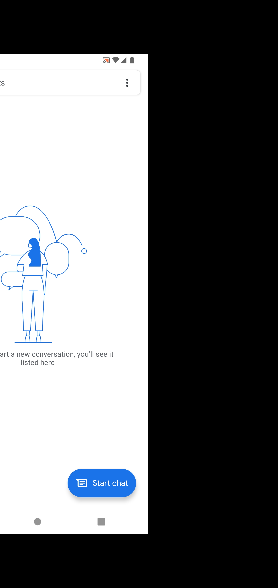

# MediaProjectionFoldable
Applications show problem with mediaProjection on foldable devices 

StackOverflow: https://stackoverflow.com/questions/77237646/android-wrong-image-size-from-mediaprojection-on-foldable-device

Android issue tracker: https://issuetracker.google.com/issues/303597311

# Steps to reproduce
1. Get current width and height in Activity:
```kotlin
   val wmc = WindowMetricsCalculator.getOrCreate()
   val bounds = wmc.computeCurrentWindowMetrics(this).bounds
```
2. Run Service for mediaProjection:
```kotlin
   val wmc = WindowMetricsCalculator.getOrCreate()
   val bounds = wmc.computeCurrentWindowMetrics(this).bounds

   val intent = Intent(this, ScreenCaptureService::class.java)
   intent.putExtra("RESULT_CODE", resultCode)
   intent.putExtra("DATA", data)
   intent.putExtra("W", bounds.width())
   intent.putExtra("H", bounds.height())
   startService(intent)

```
3. Create ScreenCaptureService with mediaProjection:
```kotlin
   val mediaProjectionManager = getSystemService(MEDIA_PROJECTION_SERVICE) as MediaProjectionManager

        width = intent.getIntExtra("W", 0)
        height = intent.getIntExtra("H", 0)

        imageReader = ImageReader.newInstance(width, height, PixelFormat.RGBA_8888, 2)
        imageReader!!.setOnImageAvailableListener({
            // save iamge!
        }, mHandler)

        mediaProjection = mediaProjectionManager.getMediaProjection(...)


        virtualDisplay = mediaProjection!!.createVirtualDisplay(
            "ScreenCapture",
            width,
            height,
            Resources.getSystem().displayMetrics.densityDpi,
            DisplayManager.VIRTUAL_DISPLAY_FLAG_OWN_CONTENT_ONLY or DisplayManager.VIRTUAL_DISPLAY_FLAG_PUBLIC,
            imageReader!!.surface,
            null, null
        )
```
4. Run it on foldable device.
What we can see:


It looks like it is image has wrong size and offset.
By the way: bounds in Activity is:
```kotlin
Rect(0, 0 - 1148, 2480)
```
So, left offset is 0.